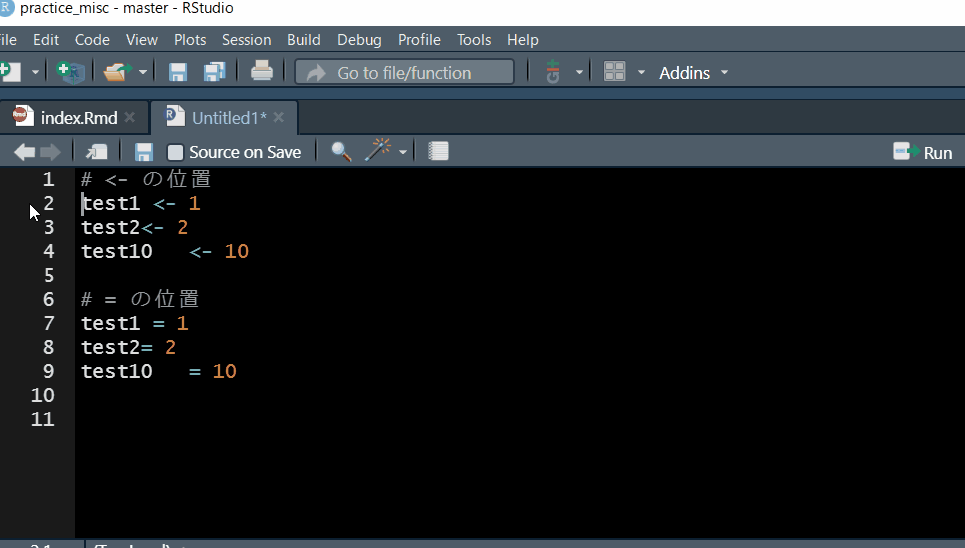

```{r setup, include=FALSE}
knitr::opts_chunk$set(echo = TRUE, warning = FALSE, message = FALSE)
```

# パッケージ読み込み

```{r}
library(tidyverse)
library(palmerpenguins)
library(janitor)
```

## パッケージ入ってない場合はインストールして読み込む場合（コードのみ表示）

* https://community.rstudio.com/t/is-it-a-good-idea-to-conditionally-load-install-libraries-at-the-beginning-of-a-script/15334/5

```{r eval = FALSE}
if (!require("palmerpenguins")) {
   install.packages("palmerpenguins")
   library(palmerpenguins)
}
```


# github連携

## githubのレポジトリをローカルに作成して管理

-   github上で`Code`\>`clone`でurlをコピー
-   RStudioで`New Project`\>`Version Control`\>`Git`\>`Repositry URL` にurl貼り付けて`Create Project`


# ベクトル操作
## 作成　 
```{r}
seq(1,3, by = 1)
seq(1,10, by = 2)
```

```{r}
rep(1, 3)
rep(1:3, 3)
rep(1:3, each = 3)
```

## 要素を削除

* dplyr::setdiff

```{r}
abcd <- c("a", "b", "c", "d")
rmitem <- c("b", "c")

abcd |> 
  setdiff(rmitem)

```

* baseの操作

```{r}
abcd [! abcd %in% rmitem]
```

```{r include=FALSE}
rm(abcd, rmitem)
```

## 要素のソート
```{r}
sort(c("c", "a", "b"))
```


# 正規表現

* regular expression (regexp)
* 参照
  + https://stringr.tidyverse.org/articles/regular-expressions.html

## 数字,文字
### 例の作成
```{r}
num <- c("1", "11", "111", "l", "|", "one", "一")
```

### 数字 {.tabset}

* どれも同じ

#### 一字 {-}
```{r}
str_view(num, "[0-9]")
str_view(num, "[:digit:]")
str_view(num, "\\d")
```

#### 三字 {-}
```{r}
str_view(num, "[0-9][0-9][0-9]")
```


### アルファベット {.tabset}
#### アルファベットのみ {-}
```{r}
str_view(num, "[a-z]")

```

#### 日本語も {-}
```{r}
str_view(num, "[:alpha:]") # 日本語も入る
```

#### str_view_all {-}
```{r}
str_view_all(num, "[a-z]")
```


#### 文字数指定 {-}
```{r}
str_view(num, "[a-z][a-z][a-z]")
str_view(num, "[a-z]..")
str_view(num, "[a-z]{3}")

```


### 数字とアルファベット {.tabset}
#### 一文字 {-}
```{r}
str_view(num, "[0-9a-z]")
```

#### すべて {-}
```{r}
str_view_all(num, "[0-9a-z]")
```

#### 指定文字数 {-}
```{r}
str_view(num, "...")
```


## 単語のつながり
### 例の作成
```{r}
text <- c("test", "test_test", "test_test_test", "testtest", 
          "test_testtest", "testtest_test", "test_test_","teest_teest")
```

### 繰り返し {.tabset}
#### 一回 {-}
```{r}
str_view(text, "(....)_\\1")
str_view(text, "(.+)_\\1")
str_view(text, "(....)\\1")
str_view(text, "(....)\\1_\\1")
```

#### 二回 {-}
```{r}
str_view(text, "(....)_\\1_\\1")
```


## 区分する点を探す

* 変数名でpivot_longerするときに

### 検討用データフレーム作成
```{r}
mtcars_vsam <- 
  mtcars |> 
  summarise(across(c(vs, am),
                   list(
                     p = \(x) mean(x, na.rm = TRUE),
                     n = \(x) sum(x, na.rm = TRUE),
               total_n = \(x) sum(!is.na(x))
                   ))
            )

mtcars_vsam

# purrr 1.0.0より前
# mtcars_vsam <- 
#   mtcars |> 
#   summarise(across(c(vs, am),
#                    list(
#                      p = ~mean(., na.rm = TRUE),
#                      n = ~sum(., na.rm = TRUE),
#                total_n = ~sum(!is.na(.))
#                    ))
#             )
```

#### meanとsdを列名にするpivot_longer(×な例)

* total_nも列名にもってきたい

```{r}
mtcars_vsam |> 
  pivot_longer(everything(),
               names_to = c("items", ".value"),
               names_pattern = "(.*)_(.*)")
```


### 変数名の文字の長さ確認
```{r}

# 降順に並び替えて1行目を取得
max_value <- 
names(mtcars_vsam) |>
  str_count() |>
  as_tibble() |>
  arrange(desc(value))

max_value

# 文字数の最大値取得
max_value <- 
  max_value |> 
  slice(1)

# total_pの前までで切る情報を追加したいため、最大値-total_pの文字数計算

max_value - str_count("total_p")
```

#### meanとsdを列名にするpivot_longer(okな例)

```{r}
mtcars_vsam |> 
  pivot_longer(everything(),
               names_to = c("items", ".value"),
               names_pattern = "(.{1,2})_(.+)") # _の前は1～2字までに限定
```

##### {n}の挙動  {.tabset}

https://r4ds.had.co.nz/strings.html#repetition

###### 文字 {-}
```{r}

str_view("xxxxx", ".{1}")
str_view("xxxxx", "x{3}")

x <- c("xx_xxx","x_xx_xxx_xxxx_xxxxx")

str_view(x, "x{2,4}")

str_view_all(x, "x{2,4}")
```

###### 数字 {-}
```{r}
numbers <- 
  c("123", "123456", "123456789")

str_view(numbers, ".{4,}")
# str_view(numbers, ".{,9}")

str_view(numbers, ".{4,7}")

str_view(numbers, ".{4,7}?") # lazy

```


## 連続量を2値化して割合を出して1つのデータフレームに
### 2値変数作成
```{r}
df_peng <-
  penguins |>
  mutate(across(ends_with("mm"),
                list(m = \(x) if_else(x > mean(x, na.rm = TRUE),1,0)))
         )
```

### 割合とnとtotal_nを算出
```{r}

df_peng_res <- 
df_peng |>
  summarise(across(ends_with("_m"),
                   list( p    = \(x) mean(x, na.rm = TRUE),
                         n    = \(x) sum(x, na.rm = TRUE),           # bill_length_mm_mが1のn
                         total_n    = \(x) sum(!is.na(x))))  # bill_length_mm_mのna以外のn（total）
  )


# 変数名の文字の長さ確認
# 降順に並び替えて1行目を取得
max_value <- 
names(df_peng_res) |>
  str_count() |>
  as_tibble() |>
  arrange(desc(value))

max_value

# 文字数の最大値取得
max_value <- 
  max_value |> 
  slice(1)

# total_pの前までで切る情報を追加したいため、最大値-total_pの文字数計算

max_value - str_count("total_p")
```

### meanとsdを列名にするpivot_longer
```{r}
df_peng_res |> 
pivot_longer(everything(),
               names_to = c("items", ".value"),
               names_pattern = "(.{1,20})_(.+)") # _の前は1～20字までに限定
```

# 度数分布とクロス表
## 度数分布
```{r}
df <- tribble(~moji,
              "a",
              NA,
              "c",
              "a",
              "c",
              "a")
```

### 文字型でデフォルト

```{r}
df |> count(moji)
df |> tabyl(moji)
```


#### NA外して
```{r}
df |> 
  tabyl(moji, show_na = FALSE)
```

#### countで%
```{r}
df |> 
  drop_na(moji) |> 
  count(moji) |> 
  mutate(percent = n/sum(n))
```


### 因子型

* 本当はカテゴリ"b"があるがデータとしてないことを示す

```{r}
df <- 
  df |> 
  mutate(moji = factor(moji, levels = c("a", "b", "c")))

df |> count(moji)
df |> tabyl(moji)
```

#### countでデータのない水準もn=0で示す
```{r}
df |> count(moji, .drop = FALSE)

```


#### tabylでデータのない水準もn=0で示してNAは計算に入れずtotalも示す
```{r}
df |> 
  tabyl(moji, show_na = FALSE) |> 
  adorn_totals()
```

### 数字
```{r}
df <- tibble(suji = c(1,1,0,0,0,NA))

df |> tabyl(suji)

df |> 
  summarise(percent = mean(suji, na.rm = TRUE),
            n = sum(suji, na.rm = TRUE),
            total_n = sum(!is.na(suji)))

```

## クロス表

### count
```{r}
mtcars |> 
  count(gear, vs)
```

* https://stackoverflow.com/questions/66820423/r-how-to-find-the-ratio-when-using-dplyr
* https://stackoverflow.com/questions/24576515/relative-frequencies-proportions-with-dplyr

#### 割合追加

* gearの水準別のvsの割合(%)

```{r}
mtcars |> 
  count(gear, vs) |> 
  group_by(gear) |> 
  mutate(perc = n/sum(n)*100)
```

### 欠損ある場合
```{r}
penguins |> 
  count(species, sex)
```
 
#### 割合追加
##### 欠損あり
```{r}
penguins |> 
  count(species, sex) |>
  group_by(species) |>
  mutate(perc = n/sum(n)*100)
```

##### 欠損drop
```{r}
penguins |> 
  drop_na(species, sex) |> 
  count(species, sex) |>
  group_by(species) |>
  mutate(perc = n/sum(n)*100)
```


### tabyl
```{r}
mtcars |> 
  tabyl(gear, vs)
```

#### 割合 {.tabset}
```{r}
mtcars |> 
  tabyl(gear, vs) |> 
  adorn_percentages()
```

##### 割合とn {-}
```{r}
mtcars |> 
  tabyl(gear, vs) |> 
  adorn_percentages() |> 
  adorn_ns()
```

##### 割合（%）とn {-}

```{r}
mtcars |> 
  tabyl(gear, vs) |> 
  adorn_percentages() |> 
  adorn_pct_formatting() |> 
  adorn_ns()
```

##### nと割合（%) {-}

```{r}
mtcars |> 
  tabyl(gear, vs) |> 
  adorn_percentages() |> 
  adorn_pct_formatting() |> 
  adorn_ns(position = "front")
```

### 3要因以上
```{r}
penguins |> 
  count(island, species, sex) |>
  group_by(island, species) |>
  mutate(perc = n/sum(n)*100)


# mtcars |> 
#   count(gear, vs, am) |> 
#   group_by(gear, vs) |> 
#   mutate(perc = n/sum(n)*100)
```


## modelsummary::datasummary()
```{r}
modelsummary::datasummary_crosstab(species ~ sex, data = penguins)
```


# 関数

* https://dplyr.tidyverse.org/articles/programming.html
* {{}}(curly curly; doubled braces)について
  + https://www.tidyverse.org/blog/2019/06/rlang-0-4-0/#a-simpler-interpolation-pattern-with-
  + https://stackoverflow.com/questions/44121728/programming-with-dplyr-using-string-as-input
  
* {{}}とenquoの使いわけ
  + https://stackoverflow.com/questions/65627873/turn-a-dplyr-double-curly-braces-interpolation-into-a-string

## 基本
```{r}
test <- function(x){
  x + 1
  }

test(1)
```

```{r}
test_xy <- function(x,y){
  x + y
}

test_xy(1, 2)
```

* 式が1行だけなら`{}`不要

```{r}
test_simple <- function(x) x + 1

test_simple(10)
```


### 省略形

* https://www.r-bloggers.com/2021/05/new-features-in-r-4-1-0/

```{r}
test_s <- \(x){
  x + 1
  }

test_s(100)
```

```{r}
test_xy_s <- \(x,y){
  x + y
}

test_xy_s(2,3)
```


## 無名関数 anonymous function

* https://adv-r.hadley.nz/functions.html#exercises-14
* functionの定義部分を`( )`で囲むと実行できる

```{r}
(function(x) x + 1)(1)
```

### 無名関数の省略形（R4.1以降）
```{r}
(\(x) x + 1)(1)

(\(x, y) x + y)(2,3)

```

#### `\`（バックスラッシュ）の表示について

* ブラウザでHTML開いたときに円マーク￥（本当は半角）になる場合は，ブラウザのフォント設定で固定幅フォントを英語のものに変えると解決

* 具体的には，Chromeで`三点リーダ > 設定 > デザイン > フォントをカスタマイズ > 固定幅フォント`がデフォルトでMS Gothicになっている場合，ArialとかCourier Newに変える

## 関数の中身確認

* 参考
  + https://contributor.r-project.org/rdevguide/FindSource.html#finding-r-source-code
  + https://stackoverflow.com/questions/11173683/how-can-i-read-the-source-code-for-an-r-function
  + https://stackoverflow.com/questions/19226816/how-can-i-view-the-source-code-for-a-function


* 関数を()をつけずに入力して実行

```{r}
select
```

* `methods()`で調べるといくつか候補が出る

```{r}
methods(select)
```

* 元のパッケージに`:::`(注：コロン3つ)をつけてmethodsで調べた対象を入力して実行するとコードが確認できる


```{r}
dplyr:::select.data.frame
```

* または関数を使うとパッケージ名なしでもできる

```{r}
getAnywhere(select.data.frame)
```

  
## 平均値算出
### 平均値とn
```{r}
mean_n <- 
  function(data, variable){
    data |> 
      summarise(across({{variable}},
                       list(mean = \(x) mean(x, na.rm = TRUE),
                            n    = \(x) sum(!is.na(x))))
                )
  }

mean_n(penguins, where(is.numeric))
```

#### 
```{r}
mean_ns <- 
  \(data, variable){
    data |> 
      summarise(across({{variable}},
                       list(mean = \(x) mean(x, na.rm = TRUE),
                            n    = \(x) sum(!is.na(x))))
                )
  }

mean_ns(penguins, where(is.numeric))
```


#### 確認
```{r}
penguins |> 
      summarise(across(where(is.numeric),
                       list(mean = \(x) mean(x, na.rm = TRUE),
                            n    = \(x) sum(!is.na(x))))
                )
```


### 平均値とnで列をmeanとnに
```{r}
cmean_n <- 
  function(data, variable){
    data |> 
      summarise(across({{variable}},
                       list(mean = \(x) mean(x, na.rm = TRUE),
                            n    = \(x) sum(!is.na(x))))
      ) |> 
      pivot_longer(everything(),
                   names_to = c("variables", ".value"), # ".value"の部分を列名に
                   names_pattern = "(.*)_(.*)")
  }

cmean_n(penguins, where(is.numeric))
```

#### 確認
```{r}
penguins |> 
      summarise(across(where(is.numeric),
                       list(mean = \(x) mean(x, na.rm = TRUE),
                            n    = \(x) sum(!is.na(x))))
      ) |> 
      pivot_longer(everything(),
                   names_to = c("variables", ".value"), # ".value"の部分を列名に
                   names_pattern = "(.*)_(.*)")
```

### totalとgroupの平均値とnを一気に算出

* https://community.rstudio.com/t/using-map-with-a-vector-of-variables-and-dplyr-programming/93088

```{r}
all_group = function(data, outcome_vars, group_vars = NULL) {
  data |> 
    group_by(across({{group_vars}})) |> 
    summarise(across({{outcome_vars}}, 
                     list(mean = \(x) mean(x, na.rm = TRUE),
                          n    = \(x) sum(!is.na(x)))))
}

all_group(penguins, bill_length_mm)
all_group(penguins, bill_length_mm, species)


```

#### 確認
```{r}
penguins |> 
  summarise(across(bill_length_mm,
                   list(mean = \(x) mean(x, na.rm = TRUE),
                          n    = \(x) sum(!is.na(x)))))

penguins |> 
  group_by(species) |> 
  summarise(across(bill_length_mm,
                   list(mean = \(x) mean(x, na.rm = TRUE),
                          n    = \(x) sum(!is.na(x)))))
```


#### mapでリストに結果を格納
```{r}
quos(NULL, species) |> 
  map( \(x) all_group(penguins, bill_length_mm, !!x))


quos(NULL, species, island, c(species, island)) |> 
  map( \(x) all_group(penguins, bill_length_mm, !!x))
```


#### 1つのデータフレームに

```{r}
quos(NULL, species) |> 
  map( \(x) all_group(penguins, bill_length_mm, !!x)) |> 
  bind_rows()

# こちらでもOK
# quos(NULL, species) |> 
#   map_dfr( \(x) all_group(penguins, bill_length_mm, !!x))
```


```{r}
quos(NULL, species, island, c(species, island)) |> 
  map(\(x) all_group(penguins, bill_length_mm, !!x)) |> 
  bind_rows()

# こちらでもOK
# quos(NULL, species, island, c(species, island)) |> 
#   map_dfr( \(x) all_group(penguins, bill_length_mm, !!x))
```


## クロス表
### 複数層別と単一のアウトカム
```{r}
nest_tabyl = function(df, outcome_var, nest_vars = NULL){
df |>
  nest(data = !c({{nest_vars}})) |>
    mutate(freq =
           map(data, \(x) tabyl(x, {{outcome_var}}))) |> # show_na = FALSEで欠損無しのpercentのみ算出
  select(!data) |>
  unnest(cols = c(freq)) |>
  as_tibble()
}

# island x species
nest_tabyl(penguins, species, island)

# speciesのみ
nest_tabyl(penguins, species)

# 動かない
# nest_tabyl(penguins, c(species, island))


```

#### 複数層別
```{r}
# 層：全体，island
quos(NULL, island) |> 
  map( \(x) nest_tabyl(penguins, species, !!x))

# 層：全体，island, sex, island x sex
quos(NULL, island, sex, c(island, sex)) |> 
  map( \(x) nest_tabyl(penguins, species, !!x))
```


#### 確認
```{r}
penguins |>
  nest(data = !c(island)) |>
    mutate(freq =
           map(data, \(x) tabyl(x, species))) |>
  select(!data) |>
  unnest(cols = c(freq)) |>
  as_tibble()
```


### 固定層別と複数のアウトカム
```{r}
# アウトカム：species, island；層：なし
quos(species, island) |> 
  map( \(x) nest_tabyl(penguins, !!x))


# 文字でもOK
vars <- c("species", "island")

vars |> 
  map( \(x) nest_tabyl(penguins, x)) # !!.xでも動いた


# アウトカム：species, island；層：sex
quos(species, island) |> 
  map( \(x) nest_tabyl(penguins, !!x, sex))


```


#### 同じ文字を含む列名を1つにまとめる

* それぞれのtabyl結果はアウトカム変数名の列名が異なる
* 単純にbind_rowsすると変数名列が横に増えていく
* それを回避するため，tabyl結果が入ったlistに，それぞれ同じ名前にrenamaeしていく

```{r}
library(psych)

ac <- 
bfi |>
  select(A1,A2,C1,C2) |> 
  names()  

# 上で定義した変数についてnest_tabyl実行
ac_res <- 
map(all_of(ac), \(x) nest_tabyl(bfi, x, gender)) |> 
  set_names(ac) # 各要素に項目名の名前を設定


# 各リスト要素の上から3つを表示
map(ac_res, \(x) head(x, 3))

# 各変数名を統一した名前にrename
ac_res <- 
ac_res |> 
  map(\(x) rename_with(x,
                   \(x) "response",               # 統一名をここに
                   starts_with(c("A", "C")))
      )

# 各リスト要素の上から3つを表示
map(ac_res, \(x) head(x, 3))


# 縦に連結
ac_res |> 
  bind_rows(.id = "items")
```


#### 複数層をみるためmtcarsで

```{r}

# アウトカム：cyl, gear；層：vs
quos(cyl, gear) |> 
  map( \(x) nest_tabyl(mtcars, !!x, vs))

# アウトカム：cyl, gear；層：vs x am
quos(cyl, gear) |> 
  map( \(x) nest_tabyl(mtcars, !!x, c(vs,am)))
```

### 複数層別と複数アウトカム

```{r}

groups <- quos(NULL, NULL, vs, am)
outcomes <- quos(cyl, gear, cyl, gear) # 層別と数をそろえるため対応する対象を繰り返す
  
  
map2(outcomes, groups,  \(x, y) nest_tabyl(mtcars, !!x, !!y))
```

#### 確認
```{r}
tabyl(mtcars, vs, cyl) |> 
  adorn_percentages()
```


### 欠損がある場合
```{r eval=FALSE, include=FALSE}

```


# rlangについて
## curly-curly {{}}

* 引数の文字そのままだけだとエラーになるので特別な指定が必要
* {{}}演算子を使えば関数の中で，データフレームの変数名を入れられる

* 参照
  + https://www.tidyverse.org/blog/2020/02/glue-strings-and-tidy-eval/
  + https://rlang.r-lib.org/reference/quasiquotation.html


### rlang 0.4.0以降から

* https://www.tidyverse.org/blog/2019/06/rlang-0-4-0/#a-simpler-interpolation-pattern-with-

```{r}
mean_by <- function(df, by, var){
df |> 
  group_by({{by}}) |> 
  summarise(mean = mean({{var}}, na.rm =  TRUE))
}

mean_by(penguins, species, bill_length_mm)
```

#### {{}}は!!enquo()のショートカット

* !!(bang-bang)
  + 単一の環境変数（<-で作られた変数）を代入する場合に使う
* enquo
  + defusing演算子
    - https://rlang.r-lib.org/reference/nse-defuse.html
  + base関数でいうsubstitute() 
  + 古い情報: https://tidyeval.tidyverse.org/sec-up-to-speed.html

```{r}
mean_by2 <- function(df, by, var){
df |> 
  group_by(!!enquo(by)) |> 
  summarise(mean = mean(!!enquo(var), na.rm =  TRUE))
}

mean_by2(penguins, species, bill_length_mm)
```

```{r eval=FALSE, include=FALSE}
# 動かない
mean_by2sym <- function(df, by, var){
  sby <- sym(by)
  svar <- sym(var)
  
df |> 
  group_by(!!sby) |> 
  summarise(mean = mean(!!svar, na.rm =  TRUE))
}

mean_by2sym(penguins, species, bill_length_mm)
```


### 作成する変数名にglueを利用する

* `:=`はセイウチ演算子（walrus operator）というらしい

```{r}
mean_by3 <- function(df, by, var, prefix = "mean"){
  df |>
    group_by({{ by }}) |>
    summarise("{prefix}_{{ var }}" := mean({{ var }}, na.rm = TRUE))
}

mean_by3(penguins, species, bill_length_mm, prefix = "mean")
```


# map関連
## データフレーム内の複数の変数に一度に関数を適用

```{r}
# 使用する変数格納
vars <-
  mtcars |> 
  select(vs,am,gear) |> 
  names()

map(vars, \(x) count(mtcars, .data[[x]])) |> 
  set_names(vars)                             # listの要素名付与

# 割合も
map(vars, \(x) count(mtcars, .data[[x]])) |> 
  set_names(vars) |> 
map(\(x) mutate(x, percent = n/sum(n)))  
```

## リストの各要素のデータフレームで特定の変数をrename
```{r}
# renameしたい変数の型を因子型に
mtcars_f <- 
  mtcars |> 
  mutate(across(all_of(vars),
                factor))

tables <- 
map(vars, \(x) count(mtcars_f, .data[[x]], .drop = FALSE)) |> 
  set_names(vars) |> 
map(\(x) mutate(x, percent = n/sum(n)))

# 各変数に対し関数を適用(tidyselect 1.2.0 >= でwarningが出るように)
# tables <- 
# map(vars, \(x) tabyl(mtcars_f, .data[[x]])) |> 
#   set_names(vars)

# 各変数のtabyl結果で連番作成
tables <- 
  map(tables, \(x) mutate(x, vid = row_number()))

# 各リスト要素の変数名の列名に文字を追加
tables <- 
tables |> 
    map(\(x) rename_with(x, 
                     \(y) str_c(y, "_test"),
                     starts_with("per")))

# purrr 1.0.0より前
# tables <- 
#   tables |> 
#   map(~rename_with(., 
#                       ~ str_c(., "_test"),
#                       starts_with("per")))

# 各リスト要素の変数名の列を同じ名前に
tables <- 
  tables |> 
  map(\(x) rename_with(x, 
                       ~ "levels",
                       where(is.factor)))

# purrr 1.0.0より前
# tables <- 
#   tables |> 
#   map(~rename_with(., 
#                       ~ "levels",
#                       where(is.factor)))

bind_rows(tables, .id = "var_name")

```

## imap & rename_with

* https://stackoverflow.com/questions/61914847/replacing-dplyrfuns-within-imap-that-refers-to-the-y-value

```{r}
df_2020 <- tribble(
~id, ~var1, ~var2,
1, 1, 0,
2, 0, 1,
3, 1, 1
)

df_2021 <- tribble(
~id, ~var1, ~var2,
1, 0, 0,
2, 1, 0,
3, 1, 1
)

# データフレームをリストにまとめて要素名をつける
df_list <- 
  list(df_2020, df_2021) |> 
  set_names("y20", "y21")

# リスト内のデータフレームのid以外の変数に要素名の接尾辞をつける
df_list <- 
 imap(df_list,
       function(a,b){
         rename_with(a,
          \(x) {str_c(x, b, sep = "_")}, !id)}
      )

df_list

# リスト内のデータフレームを横に連結

df_list |>
  reduce(full_join, by = "id")

```

## 回帰：複数のアウトカムに同じ説明変数
```{r}
# アウトカム変数名格納
outcomes <- 
  penguins |> 
  select(ends_with("_mm")) |> 
  names()
  
# 回帰
res_l <- 
  str_c(outcomes, "~ species*sex") |>
  map(\(x) lm(as.formula(x), data = penguins)) |> 
  set_names(outcomes)

# 結果の要約

  res_l |> 
  map(\(x) broom::tidy(x, conf.int = TRUE)) |> 
  bind_rows(.id = "outcome") |> 
    print(n = 18)
```


# 要約いろいろ
## psych::describe

* 数値の要約には便利

```{r}
describe(penguins)
```

## skimr
### ヒストグラムなし
```{r}
library(skimr)

skim_without_charts(penguins) |> 
  as_tibble()

```

### 型を限定
```{r}
skim(penguins) |> 
yank("numeric") |> 
  as_tibble()
```

### 層別
```{r}
penguins |> 
  group_by(sex) |> 
  skim() |> 
  as_tibble()
```

#### 層別に特定の変数の平均とSD
```{r}
penguins |> 
  group_by(species, sex) |> 
  skim(bill_length_mm, bill_depth_mm) |> # selectを先にもってきてもよい
  as_tibble()
```

#### 層別にnを表示

* https://github.com/ropensci/skimr/issues/505

```{r}
my_skim <- skim_with(base = sfl(n = length))

penguins |> 
  group_by(species, sex) |> 
  my_skim(bill_length_mm) |>
  as_tibble()

```


### longに
```{r}
to_long(penguins)
```

## Data Explorer

https://rpubs.com/mark_sch7/DataExplorerPackage

```{r}
# devtools::install_github("boxuancui/DataExplorer")
library(DataExplorer)
```

### グラフ {.tabset}
#### 頻度の棒グラフ
```{r}
plot_bar(penguins)
```

```{r eval=FALSE, include=FALSE}
plot_bar(penguins, with = )
```

#### ヒストグラム
```{r}
plot_histogram(penguins)
```

# 数字
## eの表記を数値に

* 浮動小数点表記法 floating point expression あるいは，科学的表記法 scientific notation
  + http://aoki2.si.gunma-u.ac.jp/Hanasi/StatTalk/fudoushousuu.html

```{r}
bnum <- 10000000000

bnum

format(bnum, scientific = FALSE)
```

### 設定自体を変更
```{r}
options(scipen=999)

bnum

# 戻す
options(scipen = 0)

bnum

```

## 小数点

### 四捨五入のルール

http://cse.naro.affrc.go.jp/takezawa/r-tips/r/37.html

```{r}
round(1.5)
round(2.5)
```


### 切り捨てと切り上げ
```{r}
round(0.123456, 5) # 普通の丸め
round(0.123454, 5) # 普通の丸め


# library(plyr) # dplyr読んだ後に読み込むとdplyrの関数で動かなくなるのがあるので読むならtidyverseの先に
plyr::round_any(0.123456, 0.00001, floor)   # 切り捨て
plyr::round_any(0.123454, 0.00001, ceiling) # 切り上げ
```

#### 切り捨てをtruncで工夫（整数にして割り戻す）
```{r}

trunc(0.123456*10^5)/10^5
```

#### mutateのなかで使う
```{r}
# 小数第2位まで出ている変数
mtcars |> 
  select(drat, wt)

# 変数上書き

```

##### 変数上書き
```{r}
mtcars |> 
  mutate(across(c(drat,wt),
                \(x) plyr::round_any(x, 0.1, floor))) |> 
  select(drat, wt) |> 
  head()

```

##### 変数追加
```{r}
mtcars |> 
  select(drat, wt) |>
  mutate(across(c(drat,wt),
                list(fl = \(x) plyr::round_any(x, 0.1, floor)))) |> 
    head()

```

##### trunc
```{r}
mtcars |> 
  mutate(across(c(drat,wt),
                \(x) trunc(x*10)/10)) |> 
  select(drat, wt) |> 
  head()
```

# 文字
## str_replace

* 変更する文字の対照の一覧を名前付きベクトルで作成

```{r}
moji_vec <- 
 as.character(1:3) |>                 # ベクトルの値: 変更先の文字
  set_names(c("one", "two", "three")) # 名前: 元の文字

moji_vec

x <- c("item_one", "item_two", "item_three", "item_two_three")
x

str_replace_all(x, 
            moji_vec)
```


# list
## 長さの違う要素を持つlistを2列のデータフレームにまとめる

* https://stackoverflow.com/questions/68855260/turn-a-list-with-elements-of-unequal-length-into-a-two-column-dataframe-in-r-dp

* 色々方法があるがutils::stack()が早い


```{r}

test_l <- 
  list(a = c(1,2),
       b = c(1,2,3),
       c = c(1,2,3,4))

stack(test_l)
```


# データフレーム
## 差分の確認

* joinした後に.xと.yの接尾辞がついた変数の差分作成

### joinする2つのデータフレーム作成

```{r}
p1 <-
  penguins |>
    select(species, starts_with("bill")) |> 
    slice(1:3) |> 
    mutate(id = row_number())
  
p2 <-
  penguins |>
    select(species, starts_with("bill")) |> 
    slice(4:6) |> 
    mutate(id = row_number())
```


### 関数を作成して実行

* 参考：https://github.com/tidyverse/dplyr/issues/4834

```{r}
p1_2 <-
  p1 |>
    left_join(p2, by = c("id", "species"))
  
# 対象となる変数名のベクトル作成
var_name <- 
  penguins |>
    select(starts_with("bill")) |> 
    names()
  
  
# 差分を計算する関数作成
make_dif <- function(df, var){
    df |>
      mutate(!!sym(str_c("dif_",{{var}})) :=
                    !!sym(str_c({{var}}, ".x")) - !!sym(str_c({{var}}, ".y")))
  }

make_dif2 <- function(df, var){
    df |>
      mutate("dif_{{var}}" := !!sym(str_c({{var}}, ".x")) - !!sym(str_c({{var}}, ".y")))
  }


# 動く
# make_di2 <- function(df, var){
# var1 <- sym(str_c({{var}}, ".x"))
# var2 <- sym(str_c({{var}}, ".y"))
#       df |>
#       mutate("dif_{{var}}" := !!var1 - !!var2)
#   }

# 動く
# make_di2 <- function(df, var){
# var1 <- sym("{{var}}.x")
# var2 <- sym("{{var}}.y")
#       df |>
#       mutate("dif_{{var}}" := !!var1 - !!var2)
#   }


# 動かない
# make_dif3 <- function(df, var){
# df |> 
#   mutate("dif_{{var}}" := !!sym("{{var}}.x") - !!sym("{{var}}.y"))
# }

# 動かない
# make_dif3 <- function(df, var){
#   form <- "{{var}}.x - {{var}}.y"
# df |>
#   mutate("dif_{{var}}" := !! rlang::parse_expr(form) )
# }


  
p1_2 |>
  reduce(var_name, make_dif, .init = _) |> 
  select(id, species, contains("bill_length"), contains("bill_depth")) |> 
    glimpse()


p1_2 |>
  reduce(var_name, make_dif2, .init = _) |> 
  select(id, species, contains("bill_length"), contains("bill_depth")) |> 
    glimpse()


# p1_2 |>
#   reduce(var_name, make_dif3, .init = .) |>
#   select(id, species, contains("bill_length"), contains("bill_depth")) |>
#     glimpse()

```

### longにしてから差分作成

* r-wakalangで教えてもらった
* サンプルサイズが大きすぎなければこちらの方がシンプル

```{r}
p1_long <- 
  pivot_longer(p1, !c(species, id), 
               values_to = "old")

p2_long <- 
  pivot_longer(p2, !c(species, id), 
               values_to = "new")

p1_2_long <-
  p1_long |>
    left_join(p2_long, by = c("id", "species", "name"))
  
p1_2_long |>
   mutate(diff = old - new) |>
    pivot_wider(
      names_from = name,
      values_from = old:diff,
      names_glue = "{name}_{.value}"
    )  |> 
  select(id, species, contains("bill_length"), contains("bill_depth")) |>   
    glimpse()
```


# データのサイズ
## Rで使用しているメモリ量
```{r}
pryr::mem_used()
```

## オブジェクトのサイズ
```{r}
test <- c(1:10000)
pryr::object_size(test)
```

# 変数名, 列名, column
## 出力いろいろ
```{r}
vars <- 
  penguins |>
  names()

vars
cat(vars)
dput(vars)
```

# RCTの解析

* パッケージHSAUR3をインストール

## データ
```{r}
btheb <- 
  HSAUR3::BtheB |> 
  clean_names() |>
  as_tibble()

# id付ける
btheb <- 
  btheb |> 
  rowid_to_column(var = "id") 

btheb
```

## wideからlongに
```{r}
btheb_long <- 
  btheb |> 
  pivot_longer(!c(id:treatment),
               names_to = "time",
               names_prefix = "bdi_", # timeの値から"bdi_"を削除
               values_to = "bdi")

# timeをfactorにして順序指定
btheb_long <- 
  btheb_long |> 
  mutate(time = fct_relevel(time, "pre", "2m", "3m", "5m"))


btheb_long
```


## mixed model
### mixed modelの解説

* Brown, V. A. (2021). [An Introduction to Linear Mixed-Effects Modeling in R.](https://journals.sagepub.com/doi/full/10.1177/2515245920960351) Advances in Methods and Practices in Psychological Science, 4(1), 2515245920960351.

* [GLMM FAQ](http://bbolker.github.io/mixedmodels-misc/glmmFAQ.html)


### モデル作成と実行
```{r}
mm <- 
  lme4::lmer(bdi ~ treatment*time + (1 | id), 
             data = btheb_long)

summary(mm)

```


### tidyな出力
```{r}
broom.mixed::tidy(mm, conf.int = TRUE)
```

### icc
```{r}
lme4::VarCorr(mm) |>
  as_tibble() |>
  mutate(icc = vcov/sum(vcov))
```


### グラフ
```{r}
btheb_long |> 
    mutate(id = factor(id)) |> 
    filter(id %in% c(1:20)) |> # IDが1~20までに限定
ggplot(aes(time, bdi, 
           group = id)) + # color = id
  geom_smooth(method = "lm", se = FALSE) +
  geom_point(size = 1) +
  theme_minimal() +
  facet_wrap(vars(treatment))

```


### 対比 contrast
```{r}
emmeans::emmeans(mm, specs = trt.vs.ctrl ~ time:treatment, adjust = "none")


# 邪道だけど，絶対どうしてもp値を求められている場合
# lmerTest::lmer(bdi ~ treatment*time + (1 | id), 
#               data = btheb_long) |>
#   anova()

```


## cohen's d

* EMAtools::lme.dscore()
  + lmerTestの結果のtとdfから算出
  
$$
d =  \frac{2t}{\sqrt{df}}
$$

```{r eval=FALSE, include=FALSE}
 EMAtools::lme.dscore(mm, data = btheb_long, "lme4")
```


### 手動で確認
```{r}
mmt <- 
  lmerTest::lmer(bdi ~ treatment*time + (1 | id), 
             data = btheb_long)

# 交互作用項だけに
summary(mmt)$coefficients |> 
  as_tibble(rownames = "terms") |> 
  filter(terms == "treatmentBtheB:time8m")

```

*  `(2*-0.543)/sqrt(280)` = `r (2*-0.543)/sqrt(280)`


### 参考：通常の群間のCohen's d
#### 平均値
```{r}
btheb |> 
  group_by(treatment) |> 
  summarise(mean = mean(bdi_8m, na.rm = TRUE),
            sd = sd(bdi_8m, na.rm = TRUE),
            n = sum(!is.na(bdi_8m)))
```

#### Cohen's d
##### compute.es
```{r}
compute.es::mes(13.6, 8.85, 11.5, 6.09, 25, 27)
```

##### effectsize
```{r}
effectsize::cohens_d(bdi_8m ~ treatment, data = btheb)
```


## Jacobson-Truax and reliable change indices

* Evans, C., Margison, F., & Barkham, M. (1998). [The contribution of reliable and clinically significant change methods to evidence-based mental health.](https://ebmh.bmj.com/content/1/3/70) Evidence-Based Mental Health, 1(3), 70-72.

* パッケージ
  + https://github.com/AWKruijt/JT-RCI

* BDI-IIの情報
  + 再検査信頼性:0.75
    - Erford, B. T., Johnson, E., & Bardoshi, G. (2016). Meta-analysis of the English version of the Beck depression inventory–second edition. Measurement and Evaluation in Counseling and Development, 49(1), 3-33.
  + 平均値:13.7, SD:12.2
    - U.S. general population by Internet panel survey providers
    - Choi, S. W., Schalet, B., Cook, K. F., & Cella, D. (2014). [Establishing a common metric for depressive symptoms: linking the BDI-II, CES-D, and PHQ-9 to PROMIS depression](https://www.ncbi.nlm.nih.gov/pmc/articles/PMC5515387/). Psychological assessment, 26(2), 513–527. https://doi.org/10.1037/a0035768  


```{r}
# data.frame型にする必要あり
btheb <- 
  btheb |> 
  as.data.frame()

# インストール
# devtools::install_github("AWKruijt/JT-RCI")

# jacobson & truaxのreliable and clinically significant change
JTRCI::JTRCI(data = btheb, 
      pre = "bdi_pre", post = "bdi_8m",
      group = "treatment",
      reliability = .75,
      JTcrit = "C",
      normM = 13.7, normSD = 12.2 # 健康な集団の平均値とSD,
      # dysfM = , dysfSD = 
        )
```

### 個別の結果を表示

* preとpostで欠損がリストワイズされてることに注意
* RCI > 1.96　がよい
* RCI = change_abs/Sdiff 

```{r}
JTRCIdf |> head()
```

#### 別パッケージでRCI算出

* `suddengains`パッケージ

```{r}
# メタ分析による再検査信頼性
test_retest_bdi <- 0.75

# 8mの欠損を除外したtime1でのBDIのSD
bdi_pre_sd <- 
  btheb |> 
  drop_na(bdi_8m) |> 
  summarise(sd(bdi_pre, na.rm = TRUE)) |> 
  pull()

# RCI算出
suddengains::define_crit1_cutoff(sd = bdi_pre_sd,
                    reliability = test_retest_bdi)
```

#### RCI手計算
```{r}
# pre SD
bdi_pre_sd

# standard error
se_index <- 
bdi_pre_sd*sqrt(1-test_retest_bdi)
se_index

# standar error difference
se_d <- 
  sqrt(2*se_index^2)
se_d

# pre - postが次の値を超えるとreliableな値

1.96*se_d

```


# csv読み込み
## 基本
```{r}
library(vroom)
vroom("data/penguins.csv")
```

## 読み込む変数選択
### 列を特定
```{r}
vroom("data/penguins.csv",
      col_select = c(species, sex))
```

### ヘルパー関数
```{r}
vroom("data/penguins.csv",
      col_select = starts_with("bill"))
```

### 読まない列
```{r}
vroom("data/penguins.csv",
      col_select = !c(species, island))
```

```{r}
vroom("data/penguins.csv",
      col_select = list(!c(starts_with("bill"), starts_with("s"))))
```

## 読み込む型を指定
### 変数ごとに指定

* 因子型 "f"
* skip "_"
* 文字型 "c"

```{r}
vroom("data/penguins.csv",
      col_types = c(species = "f", island = "_", bill_length_mm = "c"))
```

### すべて文字型で


```{r}
vroom("data/penguins.csv",
      col_types = c(.default = "c"))
```


# dplyrあれこれ
## select
### 変数の並びをアルファベット順にソートする

* magrittr %>% じゃないと動かない

```{r}
df <- 
  tribble(~item10, ~item1, ~item100,  ~item5, ~id,
                10,     1,      100,       5,   1) # データの値に特に意味はない

df %>% 
  select(sort(names(.)))
```

* ただし，数字の並びは昇順にならない

### 変数の並びを数字順にする
```{r}
df |> 
  select(id, num_range("item", 1:100))
```

## rowごとの処理

* https://dplyr.tidyverse.org/articles/rowwise.html

### そのまま
```{r}
df <- 
  tibble(a = c(1,  1,  1),
         b = c(NA, 2,  2),
         c = c(NA, NA, 3))

df |> 
  mutate(total = a + b + c)

df |> 
  mutate(total = sum(c(a, b, c), na.rm = TRUE))


df |> 
  mutate(mean_abc = mean(c(a,b,c), na.rm = TRUE))


# 非NAの6セルで合計10を割る
10/6
```

### rowwise
#### sum
```{r}
df |> 
  rowwise() |> 
  mutate(total = sum(c(a, b, c), na.rm = TRUE))
```

#### mean
```{r}
df |> 
  rowwise() |> 
  mutate(mean_abc = mean(c(a, b, c), na.rm = TRUE))
```


#### selection helperを使う
```{r}
df |> 
  rowwise() |> 
  mutate(mean_abc = mean(c_across(a:c), na.rm = TRUE))


df |> 
  rowwise() |> 
  mutate(mean_abc = mean(c_across(everything()), na.rm = TRUE))

```

### rowSumsとrowMean

* こっちの方が早い

```{r}
df |> 
  mutate(total = rowSums(pick(a:c), na.rm = TRUE))

df |> 
  mutate(total = rowMeans(pick(a:c), na.rm = TRUE))


# dplyr < 1.1.0
# df |> 
#   mutate(total = rowSums(across(a:c), na.rm = TRUE))
# 
# df |> 
#   mutate(total = rowMeans(across(a:c), na.rm = TRUE))

```

## rename
### 変更対応のリストを代入したい時は名前付きベクトルで
```{r}
old <- c("species", "island", "bill_length_mm")
new <- c("種", "島", "くちばし長さ")
newvars <- setNames(old, new)

penguins |>
  rename(!!!newvars)

```

#### 変更対応リストがデータフレームであるとき
```{r}
rename_df <- tibble(
old = c("species", "island", "bill_length_mm"),
new = c("種", "島", "くちばし長さ")
)

rename_df

rename_df |> 
  relocate(new) |> # newを最初に並べ替え
deframe()
```

## mutate


### 複数回答が1つの列にテキストで入っている時，回答別のフラグ列を作成
#### サンプルデータ作成
```{r}
# 区切りにスペースなし
df <- tribble(~id, ~multi_answer,
              1, "りんご,みかん,ぶどう",
              2, "りんご,ぶどう",
              3, "メロン,ぶどう",
              4, "ぶどう,りんご,みかん,メロン")

df


# スペース入っている場合
# tribble(~id, ~multi_answer,
#         1, "りんご, みかん, ぶどう",
#         2, "りんご, ぶどう",
#         3, "メロン, ぶどう",
#         4, "ぶどう, りんご, みかん, メロン") |> 
#   mutate(multi_answer = str_remove_all(multi_answer, " ")) # スペース除去


```
 
#### 文字列をリストに分割して新しい列に格納
```{r}
df <- 
  df |> 
  mutate(multi_answer_l = str_split(multi_answer, ",")) # 区切りは","

df
```
 
#### 各列に分割
```{r}
df <- 
  df |> tidyr::hoist(multi_answer_l, 
             # 列名指定   
                     f1 = 1, 
                     f2 = 2, 
                     f3 = 3, 
                     f4 = 4) 

df


```

#### 選択肢ごとにフラグを表す列を追加  
```{r}

 df |> 
  mutate(りんご = case_when(f1 == "りんご" |
                            f2 == "りんご" |
                            f3 == "りんご" |
                            f4 == "りんご" ~ 1,
                                      TRUE ~ 0),
         みかん = case_when(f1 == "みかん" |
                            f2 == "みかん" |
                            f3 == "みかん" |
                            f4 == "みかん" ~ 1,
                                      TRUE ~ 0),
         ぶどう = case_when(f1 == "ぶどう" |
                            f2 == "ぶどう" |
                            f3 == "ぶどう" |
                            f4 == "ぶどう" ~ 1,
                                      TRUE ~ 0),
         メロン = case_when(f1 == "メロン" |
                            f2 == "メロン" |
                            f3 == "メロン" |
                            f4 == "メロン" ~ 1,
                                      TRUE ~ 0)
  )
```

##### 【効率化】
###### 関数作成 
```{r}

# 回答選択肢ごとに列を作る関数作成
multi_answer <- function(data, answer){
  data |> 
    mutate(!!sym({{answer}}) := case_when(f1 == answer |
                                  　　　  f2 == answer |
                                  　　　  f3 == answer |
                                  　　　  f4 == answer ~ 1,
                                                　TRUE ~ 0))
}


multi_answer(df, "りんご")


```

###### 関数適用 
```{r}
multi_answer(df, "りんご") |> 
multi_answer("みかん") |> 
multi_answer("ぶどう") |> 
multi_answer("メロン")  


```

##### 【さらに効率化】

```{r}

contents <- 
  c("りんご", "みかん", "ぶどう", "メロン")

df_multi <- 
  map(contents, \(x) multi_answer(df, x)) |> 
  reduce(full_join)

df_multi
```

## across周り

### 作成する変数の名前をコントロール

* `across()`の中で`.names =` 引数を入れる 

```{r}
penguins |> 
  summarise(across(c(bill_length_mm, bill_depth_mm),
                   list(
                     mean = \(x) mean(x, na.rm = TRUE),
                     n    = \(x) sum(!is.na(x))),
                   .names = "{.fn}_{.col}"
                   )
            
            )

```

```{r}

```


# 回帰
## 線形
```{r}
res <- 
  lm(mpg ~ ., data = mtcars)

broom::tidy(res)
```

### 標準化係数
```{r}
res2 <- 
  lm.beta::lm.beta(res)

broom::tidy(res2)
```

# 相関
## 基本

 * https://corrr.tidymodels.org/

```{r}
library(corrr)

mtcars |> 
  correlate()
```

### 変数絞って表示
```{r}
mtcars |> 
  correlate() |> 
  focus(mpg, disp, wt, mirror = TRUE)
```

### 下側のみに
```{r}
mtcars |> 
  correlate() |> 
  focus(mpg, disp, wt, mirror = TRUE) |> 
  shave()
```


## 層別

* https://stackoverflow.com/questions/56243874/tidyverse-correlations-among-multiple-columns-grouped-by-other-column

```{r}
mtcars |>
  select(mpg, disp, wt, cyl) |>
  nest(data = !cyl) |>
  mutate(
    correlations = map(data, correlate)
  ) |>
  unnest(correlations)
```


### 1つのデータフレームに
```{r}
mtcars |> 
  select(mpg, disp, wt, cyl) |> 
  group_by(cyl) |>
  group_modify(~ correlate(.x))

```

### listのままにして加工してから1つのデータフレームに
```{r}
# groupにする変数の水準を抜き出す
cyl_level <- 
mtcars |> 
  count(cyl) |> 
  pull(cyl)

mtcars |> 
  select(mpg, disp, wt, cyl) |> 
  group_by(cyl) |> 
  group_map(~ correlate(.)) |>  # ここは旧表記じゃないと動かない
  map(\(x) shave(x)) |>         # 相関行列の上側を
  set_names(cyl_level) |>       # group変数の水準を適用
  bind_rows(.id = "cyl_level")
```


# 時間測定

## tictoc
```{r}

tictoc::tic()
# tic()とtoc()の間に処理を挟む
Sys.sleep(1) # 1秒待つ
tictoc::toc()
```

### タイトルをつけてログを残す
```{r}
tictoc::tic("1秒待つ")
Sys.sleep(1)
tictoc::toc(log = TRUE)

tictoc::tic("2秒待つ")
Sys.sleep(2)
tictoc::toc(log = TRUE)
```

#### ログ出力
```{r}
tictoc::tic.log() |> 
  unlist() |> 
  tibble()
```


# コードの書式修正

* `remedy`パッケージを読み込んだ後に修正したい範囲を指定し以下を実行
  + `<-`  Addins > Align
  +  `=`  Addins > AlignEqual

* https://thinkr-open.github.io/remedy/index.html

******  
          
      

```{r eval=FALSE, include=FALSE}
library(remedy)

# <- の位置
test1 <- 1
test2<- 2
test10   <- 10

# 修正後
test1    <- 1
test2    <- 2
test10   <- 10

# = の位置
test1 = 1
test2= 2
test10   = 10

# 修正後
test1    = 1
test2    = 2
test10   = 10


```

## 関連ショートカット

* `ctrl + I` 再インデント（階層構造をきれいにする）
* `ctrl + shift + A` 再フォーマット（複数行にする）

### 例　
```{r eval = FALSE}
mtcars |>  
select(vs,am,gear) 


```


# 引用関連

## RとR Studioまたはパッケージの引用

* [Rを引用する](http://www.okadajp.org/RWiki/?R%E3%82%92%E5%BC%95%E7%94%A8%E3%81%99%E3%82%8B)(RjpWiki)
　- `citation()`
* [Citing R](https://intro2r.com/citing-r.html)(An Introduction to R)
  - `citation("パッケージ名")`
* [Citing RStudio](https://support.rstudio.com/hc/en-us/articles/206212048-Citing-RStudio)
  - `RStudio.Version()`

## R Studioでの文献引用

* [RStudio 1.4 Preview: Citations](https://www.rstudio.com/blog/rstudio-1-4-preview-citations/)

```{r}

```

# ✍Webスクレイピング

```{r eval=FALSE, include=FALSE}
# library(rvest)
# 
# res_table <- read_html()
# 
# table_list <- 
# res_table |> 
#   html_table()
# 
# res_table_list <- 
# table_list[[2]]
```

# R Markdown
## 数式
* [Mathematics in R Markdown](https://rpruim.github.io/s341/S19/from-class/MathinRmd.html)

## チャンクの色

* https://bookdown.org/yihui/rmarkdown-cookbook/chunk-styling.html

```{r class.source="bg-info"}
# {r class.source="bg-info"}
head(mtcars)
```

```{r class.source="bg-primary"}
# {r class.source="bg-primary"}
```

```{r class.source="bg-success"}
# {r class.source="bg-success"}
```

```{r class.source="bg-warning"}
# {r class.source="bg-warning"}
```

```{r class.source="bg-danger"}
# {r class.source="bg-danger"}
```

### 出力チャンクと色分け
```{r class.source="bg-danger", class.output="bg-warning"}
# {r class.source="bg-danger", class.output="bg-warning"}

head(mtcars)
```


# R以外の関連メモ
## 画面の動画キャプチャをgifファイルに

* 動画だけならwindowsキー + G でもできる
* ScreenToGifを使う


